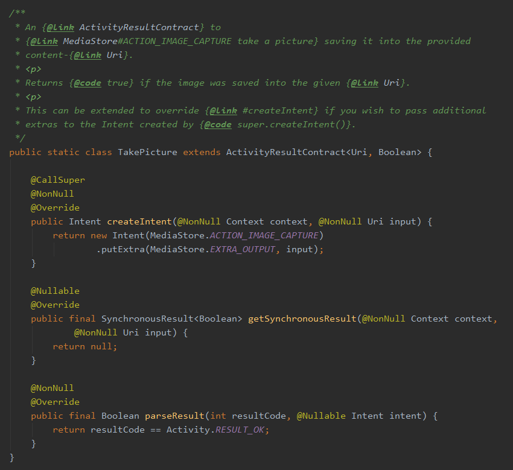

# Android StartActivityForResult Deprecated 대응 포스트


StartActivityForResult 메서드와 onActivityResult가 Deprecated 되었다.


기존에는 StartActivityForResult로 결과를 가져올 액티비티를 실행하고, 어떤 액티비티를 실행했는지에 상관 없이 반드시 onActivityResult Callback에서 결과를 처리해야 했다.

이렇게 되면 한 콜백에서 매우 많은 분기 처리가 필요하고, 아무리 매퍼를 열심히 만들어도 실행하는 액티비티가 많아질수록 코드가 매우 길어지게 되어있다. 심지어 Result Code가 각각 다르다면... 끔찍하게 길어질 것이다.

Google에서 이걸 의식해서인지, (또 다른 의도가 있어서 변경한 것인지는 잘 모르겠지만), 새로 바뀐 방식인 Launcher를 쓰게 되면 콜백이 모두 분리되어서 매핑하는 로직이 사라진다. 코드를 더욱 깔끔하게 짤 수 있어 매우 만족한다.


### 1. 콜백 선언

registerForActivityResult 메서드를 통해 ActivityLauncher를 만드는 것으로 시작한다.

```kotlin
private val filterActivityLauncher: ActivityResultLauncher<Intent> =
    registerForActivityResult(ActivityResultContracts.StartActivityForResult()) {
        handleSelectedFilterItems(it)
    }
```

필자는 액티비티의 멤버변수로 activityLauncher를 선언했다.

registerForActivityResult의 파라미터로는 ActivityResultContract, ActivityResultCallback이 필요하다.

해당 메서드는 ActivityResultLauncher가 반환되며, \<T\> 제네릭 타입은 액티비티를 띄울 때 필요한 input의 타입이다.

callback 람다에서는 ActivityResult 객체가 파라미터로 떨어진다. 여기에서 intent와 result code 등을 접근해서 이전에 onActivityResult에서 데이터를 가져오듯이 로직을 구성하면 된다.


#### ActivityResultContract

registerForActivityResult 를 호출할 때 이 객체를 넣어주어야 하는데, 매우 객체지향적이라고 생각했다. 


ActivityResultContract 클래스 내부를 들여다보면 미리 정의되어있는 "계약서" 객체들이 다형성을 이용해 미리 만들어져 있는 것을 확인할 수 있다.



사진, 권한등등 자주 사용되는 종류의 것들이 대부분 정의되어있다. registerForActivityResult를 호출할 때 원하는 종류의 객체를 넣어주기만 하면 손쉽게 액티비티에서 결과를 가져올 수 있다.

여기에 원하는 종류의 계약서가 없다면, ActivityResultContract 클래스를 상속받아 커스텀 Contract 클래스를 만들면 된다. output에 해당하는 타입을 정해서 바로 데이터를 꺼낼 수도 있다!! (intent에서 일일이 가져오지 않고 바로 튀어나오게 짤 수 있다.)

다형성을 매우 잘 활용한 객체 지향적인 케이스가 아닐까 생각해봤다.


### 2. 액티비티 실행

```kotlin
private fun launchFilterActivity() {
    val intent = Intent(this, FilterActivity::class.java)
    intent.putExtra("awesome_key", "awesome_value")
    filterActivityLauncher.launch(intent) 
}
```

registerForActivityResult 메서드를 통해 Callback도 정의하고, ActivityResultLauncher를 만들었으면 위와같이 실행해주면 된다.

실행하는 건 매우 간단하다. 기존처럼 intent를 정의해주고, launch()메서드를 실행하면서 intent를 넘겨주면 끝이다.


#### ActivityResultContract Custom

계약서 객체를 커스텀하는 것은 매우 간단하다.

```kotlin
class CustomContract : ActivityResultContract<Intent, Long>() {
    override fun createIntent(context: Context, input: Intent): Intent {
        return input
    }

    override fun parseResult(resultCode: Int, intent: Intent?): Long {
        return intent?.getLongExtra("awesome_key", -1) ?: -1
    }
}
```

ActivityResultContract\<I, O> 에서 I는 런처를 실행할 때의 input 타입, O는 콜백으로부터 떨어지는 인수의 타입을 적어주면 된다.

createIntent 메서드에서는 input으로부터 Intent 객체를 만들면 된다. 필자처럼 intent를 인풋으로 넘긴다면 그대로 input을 전달하면 된다.

parseResult는 intent으로부터 전달 받은 데이터를 뽑아서 리턴하면 된다. 그럼 callback 에서 해당 데이터를 원하는 타입으로 그대로 받을 수 있다. 


처음에 startActivityForResult() 가 Deprecated되어서 매우 당황했고 대체 이걸 왜...??? 라는 생각때문에 거부감이  먼저 들었다.. 그런데 바뀐 방법을 써보고 매우 편하게 사용해보면서 만족하며 사용하고 있다. 리팩터링 해야겠다 ^\____^..

