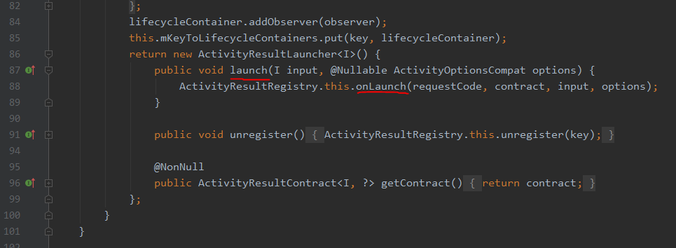
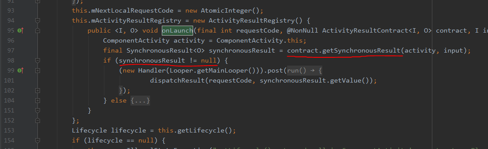
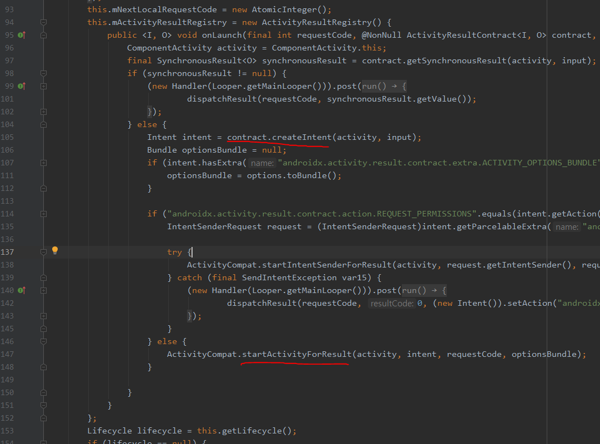
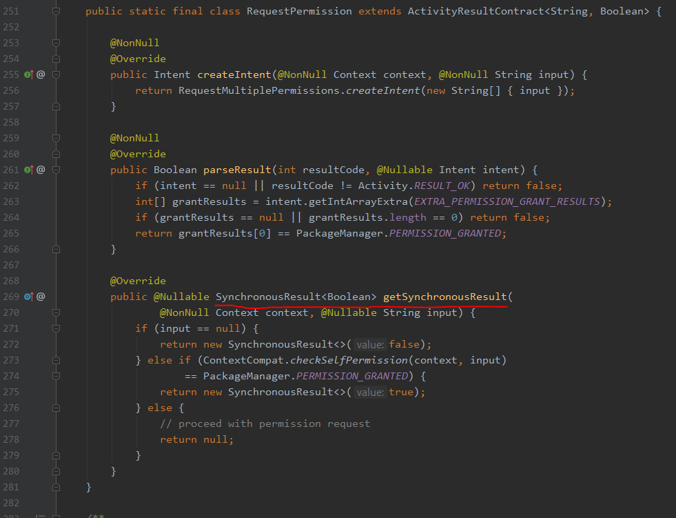

# Android StartActivityForResult Deprecated 대응 포스트


StartActivityForResult 메서드와 onActivityResult가 Deprecated 되었다.


기존에는 StartActivityForResult로 결과를 가져올 액티비티를 실행하고, 어떤 액티비티를 실행했는지에 상관 없이 반드시 onActivityResult Callback에서 결과를 처리해야 했다.

이렇게 되면 한 콜백에서 매우 많은 분기 처리가 필요하고, 아무리 매퍼를 열심히 만들어도 실행하는 액티비티가 많아질수록 코드가 매우 길어지게 되어있다. 심지어 Result Code가 각각 다르다면... 끔찍하게 길어질 것이다.

Google에서 이걸 의식해서인지, (또 다른 의도가 있어서 변경한 것인지는 잘 모르겠지만), 새로 바뀐 방식인 Launcher를 쓰게 되면 콜백이 모두 분리되어서 매핑하는 로직이 사라진다. 코드를 더욱 깔끔하게 짤 수 있어 매우 만족한다.


### 1. 콜백 선언

registerForActivityResult 메서드를 통해 ActivityLauncher를 만드는 것으로 시작한다.

```kotlin
private val filterActivityLauncher: ActivityResultLauncher<Intent> =
    registerForActivityResult(ActivityResultContracts.StartActivityForResult()) {
        handleSelectedFilterItems(it)
    }
```

필자는 액티비티의 멤버변수로 activityLauncher를 선언했다.

registerForActivityResult의 파라미터로는 ActivityResultContract, ActivityResultCallback이 필요하다.

해당 메서드는 ActivityResultLauncher가 반환되며, \<T\> 제네릭 타입은 액티비티를 띄울 때 필요한 input의 타입이다.

callback 람다에서는 ActivityResult 객체가 파라미터로 떨어진다. 여기에서 intent와 result code 등을 접근해서 이전에 onActivityResult에서 데이터를 가져오듯이 로직을 구성하면 된다.


#### ActivityResultContract

registerForActivityResult 를 호출할 때 이 객체를 넣어주어야 하는데, 매우 객체지향적이라고 생각했다. 


ActivityResultContract 클래스 내부를 들여다보면 미리 정의되어있는 "계약서" 객체들이 다형성을 이용해 미리 만들어져 있는 것을 확인할 수 있다.


사진, 권한등등 자주 사용되는 종류의 것들이 대부분 정의되어있다. registerForActivityResult를 호출할 때 원하는 종류의 객체를 넣어주기만 하면 손쉽게 액티비티에서 결과를 가져올 수 있다.

여기에 원하는 종류의 계약서가 없다면, ActivityResultContract 클래스를 상속받아 커스텀 Contract 클래스를 만들면 된다. output에 해당하는 타입을 정해서 바로 데이터를 꺼낼 수도 있다!! (intent에서 일일이 가져오지 않고 바로 튀어나오게 짤 수 있다.)

다형성을 매우 잘 활용한 객체 지향적인 케이스가 아닐까 생각해봤다.


### 2. 액티비티 실행

```kotlin
private fun launchFilterActivity() {
    val intent = Intent(this, FilterActivity::class.java)
    intent.putExtra("awesome_key", "awesome_value")
    filterActivityLauncher.launch(intent) 
}
```

registerForActivityResult 메서드를 통해 Callback도 정의하고, ActivityResultLauncher를 만들었으면 위와같이 실행해주면 된다.

실행하는 건 매우 간단하다. 기존처럼 intent를 정의해주고, launch()메서드를 실행하면서 intent를 넘겨주면 끝이다.


#### ActivityResultContract Custom

계약서 객체를 커스텀하는 것은 매우 간단하다.

```kotlin
class CustomContract : ActivityResultContract<Intent, Long>() {
    override fun createIntent(context: Context, input: Intent): Intent {
        return input
    }

    override fun parseResult(resultCode: Int, intent: Intent?): Long {
        return intent?.getLongExtra("awesome_key", -1) ?: -1
    }
}
```

ActivityResultContract\<I, O> 에서 I는 런처를 실행할 때의 input 타입, O는 콜백으로부터 떨어지는 인수의 타입을 적어주면 된다.

createIntent 메서드에서는 input으로부터 Intent 객체를 만들면 된다. 필자처럼 intent를 인풋으로 넘긴다면 그대로 input을 전달하면 된다.

parseResult는 intent으로부터 전달 받은 데이터를 뽑아서 리턴하면 된다. 그럼 callback 에서 해당 데이터를 원하는 타입으로 그대로 받을 수 있다. 


## Permission 요청

이번 변경 사항 덕분에 Permission 요청이 매우 간단하고 직관적으로 변했다. 이제 onRequestPermissionsResult 콜백을 오버라이드 할 필요가 사라진다. 정말 간단해진다.

심지어 이전에 권한을 허용 했었는지 체크하지 않아도 된다. 런처를 실행할 때 내부적으로 이전 권한 설정 검사를 하고, 이미 되어있다면 바로 콜백을 실행하고, 그렇지 않으면 그때야 권한 묻는 액티비티를 띄워준다.

엄청 잘 만들었다..... (반해 버린 모양이다)


### 1개 권한 요청

```kotlin
private fun requestCameraPermission() {
    val permissionLauncher = registerForActivityResult(ActivityResultContracts.RequestPermission()) {
        Toast.makeText(this, "무야호 $it", Toast.LENGTH_SHORT).show()
    }
    permissionLauncher.launch(android.Manifest.permission.CAMERA)
}
```

이런 식으로 권한 요청을 보내면 된다.

onCreate에서 해당 메서드를 호출해도 좋다. 이전 권한을 물어보고, 권한을 허용하지 않을 때만 해당 메서드를 실행 해야 하는 것 아니냐? 라고 생각할 수 있다. 좋은 접근이지만, 내부 코드를 들여다보면 그럴 필요가 없다.

launch 메서드를 실행하면 onLaunch() 메서드를 호출하고, 



onLaunch 메서드에서는 전달받은 Contract(계약서)의 getSynchronousResult 메서드를 실행하므로써 sychronousResult 값을 받는다. (이미지는 부분 블럭 축소 했습니다.)



sychronousResult  값이 null이 아니면 해당 값을 콜백으로 넘겨줌으로써 로직이 끝나고,  null이라면 else 구문에서 액티비티를 실행하는 로직이 있다. (이미지는 부분 블럭 축소 했습니다.)




권한 요청을 할 때 넣어주는 계약서 객체를 보면, 내부에 getSynchronousResult 메서드가 재정의 되어있는 것을 볼 수 있다. 




그러므로 이전에 권한을 허용했는지 안했는지 한 번 더 로직을 구성할 필요가 사라진다.

그냥 onCreate에 launch 코드를 박으면된다.

처음의 메서드를 아래 처럼 더 간결하게 사용해도 무방하다고 생각된다.

```kotlin
private fun requestCameraPermission() {
    registerForActivityResult(ActivityResultContracts.RequestPermission()) {
        Toast.makeText(this, "무야호 $it", Toast.LENGTH_SHORT).show()
    }.launch(android.Manifest.permission.CAMERA)
}
```


### 여러개 권한 요청

이것도 위와 다를게 없다. RequestMultiplePermissions 계약서를 넣어주면, 콜백에서 Map<String,Boolean> 구현체가 떨어진다. 이걸로 어떤 권한이 허용되었고 거절되었는지 직관적으로 알 수 있다.

```kotlin
private fun requestPermissions() {
    registerForActivityResult(ActivityResultContracts.RequestMultiplePermissions()) {
        Log.d("무야호", "$it")
    }.launch(PERMISSIONS_REQUESTED)
}

companion object {
    private const val PERMISSION_CAMERA = android.Manifest.permission.CAMERA
    private const val PERMISSION_LOCATION = android.Manifest.permission.ACCESS_COARSE_LOCATION
    private const val PERMISSION_CALL = android.Manifest.permission.CALL_PHONE
    private const val PERMISSION_RECORD = android.Manifest.permission.RECORD_AUDIO

    private val PERMISSIONS_REQUESTED: Array<String> = arrayOf(
            PERMISSION_CAMERA,
            PERMISSION_LOCATION,
            PERMISSION_CALL,
            PERMISSION_RECORD
    )
}
```

1개 권한을 요청하는 계약서가 여러개 요청하는 계약서를 이용해서 로직이 짜여져있기 때문에, 내부 로직은 동일하게 작동한다. 다형성 짱


---


처음에 startActivityForResult() 가 Deprecated되어서 매우 당황했고 대체 이걸 왜...??? 라는 생각때문에 거부감이  먼저 들었다.. 그런데 바뀐 방법을 써보고 매우 편하게 사용해보면서 만족하며 사용하고 있다. 리팩터링 해야겠다 ^\____^..

