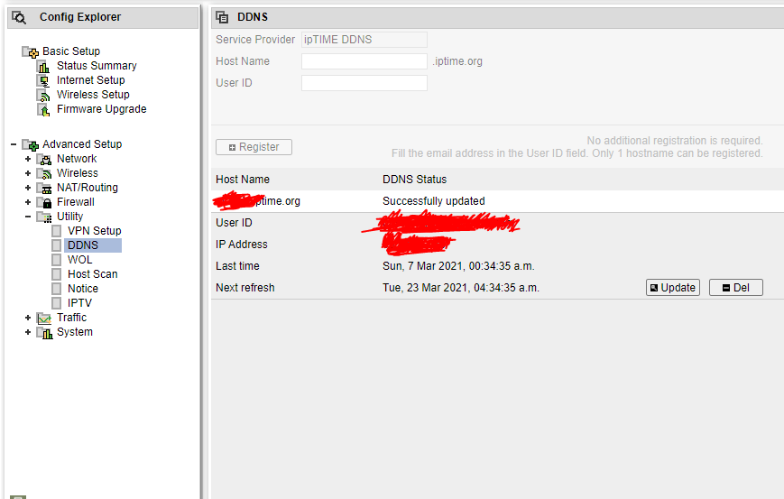
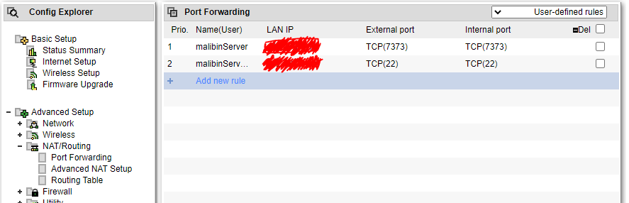
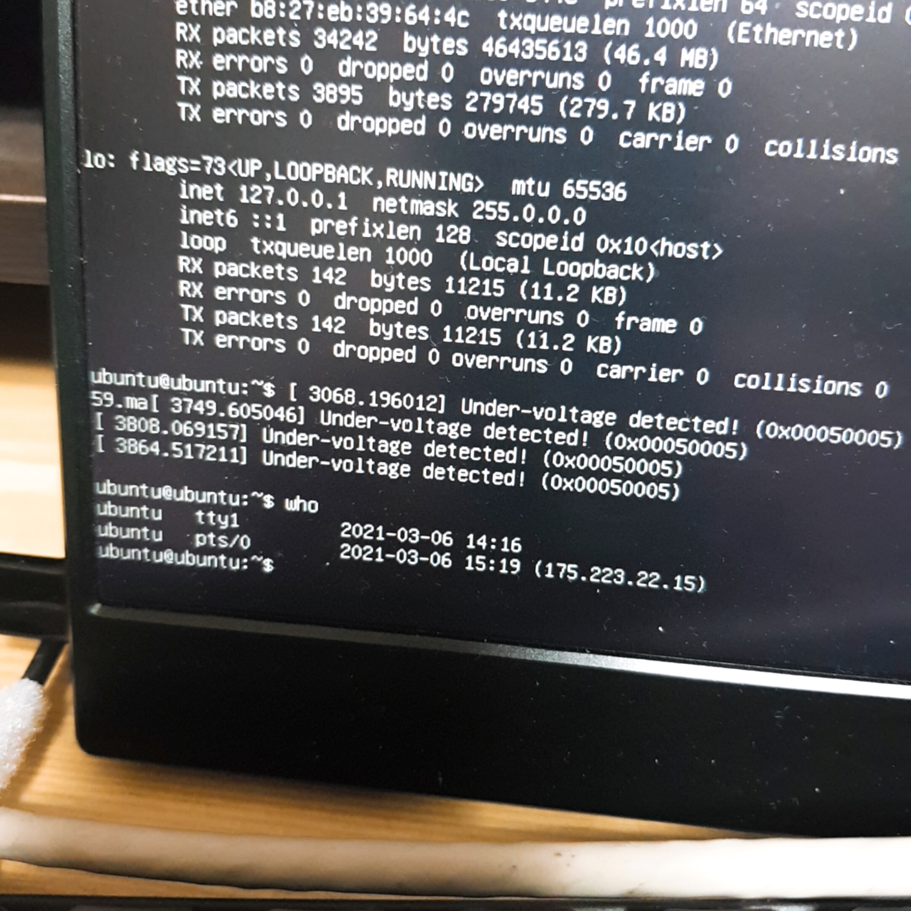

# 라즈베리 파이3로 개인 서버 만들기 - 부팅/접속편

집에 굴러다니던 라즈베리파이3 모델 B+가 있어서 개인 서버로 만들어서 원할 때 쓰는 게 어떨까 하고 생각이 나서 바로 주말에 행동으로 옮겼다 ㅎㅎ

### 준비해야할 것

일단 보드만 있어서 첨부터 뭘 어째야 될지 모르겠다가 전원 케이블이 없다는 걸 알게됐다 ㄷㄷ;;

그러고 허둥대다가 전자쪽 하시는 아빠한테 전원 케이블 혹시 있는지 물어보고...

알고보니 마이크로 USB쪽이 전원 공급 하는 곳이었다 ^___^........

공식 홈페이지 검색은 필수다.. 😅😅😅

아무튼..  그 다음에 모니터, 키보드, 전원을 다 연결했는데, 모니터에 아무것도 안나왔다.

왜지..?

라즈베리 파이 OS를 마이크로 SD 카드에 설치해서 꽂아줘야한다..

머리가 나쁘면 몸이 고생합니다. (공홈을 더 자세히 보자 ^____^;;;)

먼저 [공홈 사이트](https://www.raspberrypi.org/documentation/installation/installing-images/README.md)를 참고하고, [OS를 SD카드에 다운받기](https://www.raspberrypi.org/software/)를 먼저 한다.

그리고 부팅하고, 안내 대로 업데이트 진행을 하면 끝. 라즈베리 파이로 우선 컴퓨터 구실을 할 수 있다.

내장 크로미움으로 웹브라우저도 띄울 수 있다.

### Ubuntu 설치

하지만 필자는 라즈비언보다 우분투를 깔고싶었기에 우분투를 깔 것이다.

[Ubuntu For Raspberry Pi](https://ubuntu.com/download/raspberry-pi)

SD카드를 열심히 구워주고 부팅한다.

나중에 SSD를 하나 사서 다시 구축해봐야겠다.

처음 부팅되고 이것저것 알아서 깔다보면, 로그인을 하라는 화면이 나온다.

하지만 페이크다. 처음 위 처럼 나올 때 아무리 아이디 패스워드를 입력해도 incorrect 어쩌구가 나온다.

여기서 그저 기다리기만 하면 (왜그런진 알수없지만) 알아서 뭔가 과정을 거쳐 아래같은 화면이 나온다.

웃긴건 이 상태에서 아이디를 쳐야한다는 점이다.

필자는 "왜캐 안되지?" 하고 엔터를 쳤더니 바로 패스워드 나오는 화면이 나왔다.

(짜증)

아무튼 한 번 실패하고나서 ubuntu / ubuntu를 입력해줬다.

새로운 패스워드를 설정해 주고 한 번 껐다 켜줬다.

이제 익숙하게 본 명령창이 나온다.

(전원 분명 5V 3A 어댑터인데 Under-voltage경고가 뜬다.. 폰 급속 충전기라 전원 공급이 일정하지 않아서 그런듯 하다.)

### 외부 접근 열기

이제 리눅스도 올렸겠다, 외부에서 접근 가능하도록 만들어 볼 것이다.

#### DDNS 설정

인터넷이 동적 IP 할당으로 주소가 계속 바뀌니 DDNS 설정을 했습니다. iptime 공유기에서 제공해줘서 개꿀~~

#### 포트포워딩

이젠 특정 포트를 통해 라즈베리파이에 접근하기 위해서 포트포워딩을 해줬다.

SSH 접근을 위해 22포트를 열었고, 나중에 api 서버를 위해 7373 포트도 열었다.

내부 아이피를 알기 위해서 리눅스에 net-tools도 깔았다. (ifconfig 명령어를 위해 sudo apt install net-tools)

### 완성

폰으로 핫스팟을 키고 노트북으로 와이파이를 잡은 다음에 내 라즈베리파이로 SSH 접속을 시도해봤다.

라즈베리파이에서 who 명령어를 통해 현재 접속 중인 사용자 목록을 보니!!

접속이 되어있는 것을 확인했다. 무야호~~

리눅스 끄는건 sudo poweroff 를 치자