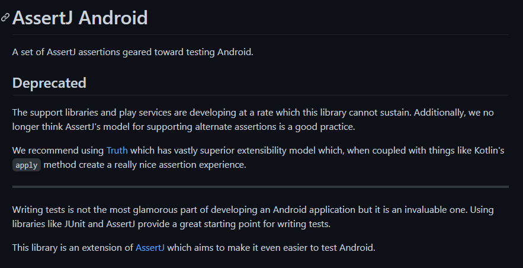

# 안드로이드 테스트 코드 Truth with JUnit5

## AssertJ Android

이전에 하던 스터디와 NextStep에서 배웠고, 써왔던 assertJ와 Junit5를 안드로이드에서도 쓰려고 assertJ android 깃허브를 들어갔는데.......



예...? Deprecated요...?

매우 당황스러웠지만, 글을 읽어보니 안드로이드 서포트 라이브러리와 play service 라이브러리들이 나오는게 매우 빨라 이 라이브러리를 유지하기 어렵다고 한다.

심지어 구글에서 AssertJ와 비슷한 Truth 라이브러리를 만들었으니. 이걸 쓰라고 추천해준다.

이전에 동숲 앱 만들때 Truth 라이브러리를 써봤을 때 AssertJ와 사용성이 매우 비슷했다. 안드로이드는 구글이 개발 열심히 하니 Truth도 발빠르게 대응할거라고 생각해서 앞으로의 테스트코드는 Truth를 사용하기로 결정했다.


## JUnit5

@ParameterizedTest, @DisplayedName 등 편리한 기능들을 사용하기 위해 junit5를 사용하려고 한다. 스터디와 nextstep에서 5버전을 사용해서 배워서 익숙하기도 하고, 편리한 기능들도 있고 해서 5를 선택했다.

안드로이드는 기본적으로 junit4로 테스트코드를 구성하게끔 만들어져있기 때문에 junit5를 쓰기 위해서는 플러그인이 필요하다.

1. Gradle 구성

   ```groovy
       debugImplementation "com.google.truth:truth:1.1.2"
   
       testImplementation "org.junit.jupiter:junit-jupiter-api:5.7.0"
       testImplementation "org.junit.jupiter:junit-jupiter-params:5.7.0"
       testRuntimeOnly "org.junit.jupiter:junit-jupiter-engine:5.7.0"
       testImplementation "org.jetbrains.kotlinx:kotlinx-coroutines-test:1.3.2"
   
       androidTestImplementation "androidx.test:runner:1.3.0"
       androidTestImplementation "org.junit.jupiter:junit-jupiter-api:5.7.0"
       androidTestImplementation "org.junit.jupiter:junit-jupiter-params:5.7.0"
       androidTestImplementation "org.jetbrains.kotlinx:kotlinx-coroutines-test:1.3.2"
       androidTestImplementation "de.mannodermaus.junit5:android-test-core:1.0.0"
       androidTestRuntimeOnly "de.mannodermaus.junit5:android-test-runner:1.0.0"
   ```

   필자는 Truth, coroutineTest를 사용하기 때문에 위 처럼 Gradle구성을 추가했다. 안드로이드 스튜디오에서 프로젝트를 만들 때 자동으로 추가해주는 test 의존성도 포함했다.

   

2. 테스트 러너 설정

   안드로이드 테스트 러너는 기본적으로 JUnit4 환경에서 동작한다. 

   ```groovy
   android {
     defaultConfig {
       testInstrumentationRunner "androidx.test.runner.AndroidJUnitRunner"
       testInstrumentationRunnerArgument "runnerBuilder", "de.mannodermaus.junit5.AndroidJUnit5Builder"
     }
   }
   ```

   위 설정을 추가하지 않으면 테스트 코드들은 자동으로 JUnit4 환경에서 동작하므로 JUnit5를 사용한다면 반드시 추가해야한다.
   
3. Java 8버전 설정

   ```groovy
   // For Java
   android {
     compileOptions {
       sourceCompatibility JavaVersion.VERSION_1_8
       targetCompatibility JavaVersion.VERSION_1_8
     }
   }
   
   // For Kotlin
   tasks.withType(KotlinCompile) {
     jvmTarget = JavaVersion.VERSION_1_8
   }
   ```

   JUnit5 플러그인을 사용하려면 Java8 버전을 사용 해야한다고 한다. 요즘 안드로이드 프로젝트를 새로 만들면 대부분 자바 8버전에 대한 설정이 자동으로 들어가므로 필자는 스킵했다.
   
4. 패키징 설정

   ```groovy
   android {
     packagingOptions {
       exclude "META-INF/LICENSE*"
     }
   }
   ```

   위 패키징 설정을 하지 않으면 컴파일 중 아래와 같은 에러가 발생하기도 한다.

   ```
   More than one file was found with OS independent path 'META-INF/LICENSE'
   ```

   플러그인 Github 코멘트에 따르면,

   >The different JUnit 5 libraries add conflicting files into the generated test APK, which may cause a failure during compilation.

   각 JUnit5 라이브러리들이 테스트 APK에다가 중복 파일들을 생성해 충돌난다는 의미다. 

   

### Rule Migration

안드로이드 테스트에서는 JUnit4의 Rule를 왕왕 이용한다.

하지만 JUnit5에서는 Rule이 삭제되고 Extension으로 대체되었다. 그래서 비동기적인 안드로이드 아키텍쳐 (특히 LiveData) 동기적으로 다룰 때 필요한 InstantTaskExecutorRule을 JUnit5에 맞게 개조 해야했다. 또, 코루틴 Dispatcher 설정을 위한 CoroutineExtension을 만들었다.

```kotlin
class InstantTaskExecutorExtension : BeforeEachCallback, AfterEachCallback {
    override fun beforeEach(context: ExtensionContext?) {
        ArchTaskExecutor.getInstance().setDelegate(object : TaskExecutor() {
            override fun executeOnDiskIO(runnable: Runnable) {
                runnable.run()
            }

            override fun postToMainThread(runnable: Runnable) {
                runnable.run()
            }

            override fun isMainThread(): Boolean {
                return true
            }
        })
    }

    override fun afterEach(context: ExtensionContext?) {
        ArchTaskExecutor.getInstance().setDelegate(null)
    }
}
```

```kotlin
@ExperimentalCoroutinesApi
class MainCoroutineExtension(
    private val testDispatcher: TestCoroutineDispatcher = TestCoroutineDispatcher(),
) : BeforeEachCallback, AfterEachCallback,
    TestCoroutineScope by TestCoroutineScope(testDispatcher) {

    fun runBlockingTest(
        block: suspend TestCoroutineScope.() -> Unit
    ) = testDispatcher.runBlockingTest(block)

    override fun beforeEach(context: ExtensionContext?) {
        Dispatchers.setMain(testDispatcher)
    }

    override fun afterEach(context: ExtensionContext?) {
        Dispatchers.resetMain()
        testDispatcher.cleanupTestCoroutines()
    }
}
```


만든 Extension 클래스들은 아래와 같이 Test Class에서 사용한다.

```kotlin
@ExtendWith(InstantTaskExecutorExtension::class)
@ExperimentalCoroutinesApi
class CardsDaoTest {

    companion object {
        @JvmField
        @RegisterExtension
        val coroutineExtension = MainCoroutineExtension()
    }

	/*.....중략.....*/

    @Test
    @DisplayName("카드 Id로 카드 한 장 조회가 가능하다")
    fun 카드Id로_카드_한_장_조회가_가능하다() = coroutineExtension.runBlockingTest {
        // given
        cardsDao.insertCards(listOf(리로이젠킨스))
        val 리로이젠킨스_카드id = 559

        // when
        val card = cardsDao.fetchCard(리로이젠킨스_카드id)

        // then
        assertThat(card).isEqualTo(리로이젠킨스)
    }
}
```


### This job has not completed yet

Room Dao Coroutine Test를 하면서 위 에러를 해결하는데 정말 오래걸렸다. 

처음에는 내가 JUnit5를 사용해서 이런 문제가 생기는 것이라 생각했는데, 전혀 아니었다. 지금은 동작하고 있기 때문!

안드로이드 DevSummit에서 다룬 내용과 기타 coroutine을 테스트 하기 위해서 주의 해야할 점들을 잘 공부했다고 생각했는데도 위 문제가 계속 발생했다.

간단하게, 테스트 코드에서 다른 코루틴 스코프를 실행할 때 해당 스코프는 다른 스레드에서 실행되기 때문에 테스트 코드는 실패로 끝난다. 그래서 MainCoroutineExtension 이란 클래스를 만들어 Dispatcher를 조정해주었다. TestCoroutineDispatcher와 TestCoroutineScope로.

그런데 내가 테스트하는 건 단순히 suspend 함수이고 다른 Dispatcher를 가진 Coroutine Scope를 실행시키지 않는다.

그래서 결국엔 InstantTaskExecutorExtension을 추가함으로써 해결했다. 이렇게 하니 테스트코드가 정상적으로 실행되는 것을 확인했지만 매우 찜찜했다. 그냥 되기만 하는 코드를 만난 기분이랄까?


#### 결국 원인 파악하고 해결!!

Room이 내부적으로 다른 Scope를 실행하는걸까? 라는 생각을 하게 되었다. 아, 왜 이생각을 못했을까. 분명 Room을 Main Thread에서 동작시키게 바꿀 수있는 설정이 있었는데 말야. 이 생각을 그대로 검색에 옮겨보니 내 생각이 맞다는 것을 증명한 블로그가 나왔다.

[Room Dao 사용시 This job has not completed yet 에러 검색한 블로그 링크](https://medium.com/@eyalg/testing-androidx-room-kotlin-coroutines-2d1faa3e674f)

지금은 InstantTaskExecutorExtension를 삭제하고 아래 처럼 코드를 수정해서 해결했다.

```kotlin
@ExperimentalCoroutinesApi
class CardsDaoTest {

    companion object {
        @JvmField
        @RegisterExtension
        val coroutineExtension = MainCoroutineExtension()
    }

    private lateinit var cardsDao: CardsDao

    @BeforeEach
    fun dao_초기화() {
        cardsDao = Room.inMemoryDatabaseBuilder(
            InstrumentationRegistry.getInstrumentation().context,
            HearthStoneDataBase::class.java
        ).setTransactionExecutor(coroutineExtension.testDispatcher.asExecutor())
            .setQueryExecutor(coroutineExtension.testDispatcher.asExecutor())
            .build()
            .cardsDao()
    }
    /*.....중략.....*/
}
```


#### 참 어려운 코루틴 테스트

처음에는 이런 깃헙 이슈들이 2년째 열려있고 해결되지 않아서 나 또한 해결 못하는 것으로 결론을 지으려 했다.

https://github.com/Kotlin/kotlinx.coroutines/issues/1204

https://github.com/Kotlin/kotlinx.coroutines/issues/1222

지금도 코멘트가 달리고 있다.

이 이슈들은 대체 뭘까... 나는 이것 때문에 내 Dao 테스트도 안되는 것으로 생각할 뻔했지만.. 원인을 알아서 해결했고. 참 어려운 프로그래밍의 세계다.


## 참고 레퍼런스

https://junit.org/junit5/docs/current/user-guide/#extensions
https://junit.org/junit5/docs/current/user-guide/#migrating-from-junit4-rule-support

https://github.com/mannodermaus/android-junit5/wiki/Instrumentation-Tests-Setup
https://github.com/mannodermaus/android-junit5

https://medium.com/@roman.tikhonov/unit-testing-kotlin-coroutines-on-android-with-junit-5-31b2c3c41157

https://developer.android.com/codelabs/kotlin-coroutines

