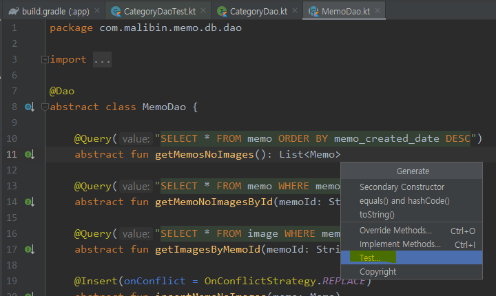
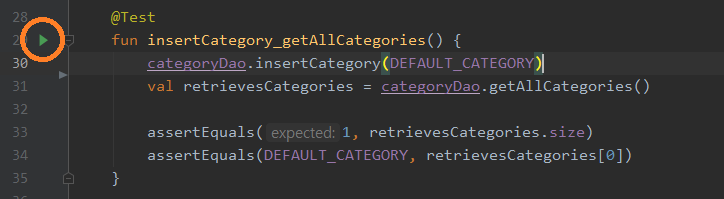
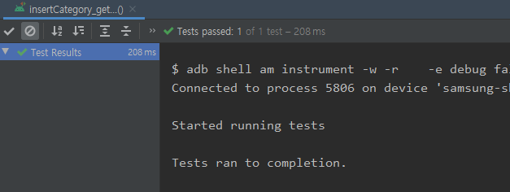
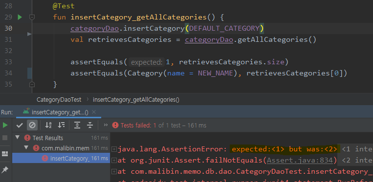

# 안드로이드 테스트코드 - 1. DAO of Room Test [Android Test Code For Dao of Room]


  MVVM Architecture의 Model 부분에 해당하는 Dao레이어의 테스트 코드 작성에 대해서 포스팅 하려 합니다.

예제 코드로 사용할 프로젝트는 [라인 앱챌린지를 진행했던 메모앱](https://github.com/nightmare73/memo)이 기반입니다. 
위 프로젝트는 [Google MVVM Sample Code](https://github.com/android/architecture-samples/tree/todo-mvvm-live-kotlin)를 모방한 프로젝트입니다.
또한, 모든 컴파일과 테스트는 실제 기기인 Galaxy S8+ 에서 실행하였습니다.


## 안드로이드 테스트 종류?

안드로이드 테스트코드에서는 크게 두 종류의 테스트로 나눌 수 있습니다.

* 안드로이드 Context 나 SDK에 의존적인 Instrument Test
* 그 외에 안드로이드에 의존성이 없는 Unit Test

AAC의 Room은 SQLite를 기반으로 한 라이브러리이기 때문에 안드로이드 Context를 반드시 필요로 합니다. 그렇기 때문에 안드로이드에 의존적인 Instrument 테스트를 진행 해 주셔야 합니다.


## Test Dependencies

  테스트를 하기 위해서 사용되는 라이브러리를 사용하기 위해 의존성을 추가 해주어야 합니다. 안드로이드 스튜디오에서는 기본적으로 Espresso와 자체 Test Tool 을 Gradle에 추가해줍니다.

  이곳에서 주의해야 할 점은, Unit Test 에서 사용되는 의존성은 반드시 **testImplementation** 키워드를 사용해야하며, Instrumentation Test에서 사용되는 의존성은 반드시 **androidTestImplementation** 키워드를 사용하여 의존성을 추가해 주어야합니다.

  만약 같은 라이브러리를 InstrumentTest 와 UnitTest 에서 모두 사용한다면, 두 키워드를 사용하여 각각 의존성을 추가해주셔야합니다.

>  여담으로 Mockito를 사용하여 테스트를 진행할 때,  아래처럼 의존성을 추가하여 테스트코드를 작성했으나, Unit Test에서는 컴파일 에러가 발생했고 그 에러때문에 몇 시간을 삽질했던 경험으로 알게되었습니다 ㅠㅜ

```
    androidTestImplementation "org.mockito:mockito-core:2.25.0"
```


## 기본 세팅

  저는 위 프로젝트에 Dependency Injection으로 Koin을 사용하였습니다. 당시 Koin을 학습하고 적용해보는 단계였기에 사용이 어색할 수 있습니다. Koin을 사용하여 Database를 주입받아 사용하였기 때문에 아래 처럼 Koin Test를 위한 의존성을 추가해 주었습니다.

```
    androidTestImplementation "androidx.room:room-testing:2.2.3"
    androidTestImplementation 'androidx.test.ext:junit:1.1.1'
    androidTestImplementation "org.koin:koin-test:2.0.1"
```


###   Koin Injection 으로 DB 테스트를 할 때의 단점!

  제 경험으로는, Koin Injection으로 실제 폰의 Android Context를 가져와 Room Persistence를 생성하다보니, 실제 폰에 데이터가 저장되는 현상을 겪었습니다.

  만약 insert에 해당하는 테스트를 진행 한 후, 방금 insert한 데이터를 직접 지워주지 않으면 기기에 계속해서 남아있는 현상이 발생하였습니다. 이전에는 이 현상을 각 테스트가 끝날 때 마다 insert 했던 데이터를 지워주는 코드를 작성하여 문제를 해결하였습니다.

  하지만 이 현상은 Room 의 In Memory Database를 생성해서 사용하면 해결 되는 문제였습니다! 이 이슈는 해당 프로젝트를 마무리할 때 까지 알지 못했던 터라, In Memory를 사용하지 않고 위에서 해결한 방법 그대로 코드가 남아있기에, 이 포스팅에서는 In Memory Database를 사용하지 않겠습니다.

  아래는 In Memory Database를 생성하는 예시입니다.

```kotlin
class TasksDaoTest {

    private lateinit var database: ToDoDatabase

    @Before
    fun initDb() {
        database = Room.inMemoryDatabaseBuilder(InstrumentationRegistry.getInstrumentation().context,
                ToDoDatabase::class.java).build()
    }

    @After
    fun closeDb() = database.close()
    
    ...
    
}
```

> 출처 : [Google Architecture Sample Code](https://github.com/android/architecture-samples/tree/todo-mvvm-live-kotlin)


## 테스트 코드 생성

  Class 파일에서는 Alt + Insert 단축키를 통해 아래 처럼 Test 를 자동으로 생성해 줄 수 있습니다. 



하지만, Interface는 Test 코드를 자동으로 생성해 주지 않습니다. 그러므로 직접 테스트 패키지에서 테스트 코드를 작성해 주어야 합니다.


위 처럼 dao가 위치한 동일 패키지 경로에 테스트 클래스를 생성해줍니다.


## 본격적인 Dao 테스트 !

  이제, CategoryDao 메소드를 테스트 해보기로 하겠습니다.

우선 Entity Class로 사용된 Category Data Class 입니다.

```kotlin
@Entity
data class Category(

    @PrimaryKey
    @ColumnInfo(name = "category_id")
    val id: String = UUID.randomUUID().toString(),

    @ColumnInfo(name = "category_name")
    var name: String,

    @ColumnInfo(name = "category_color_code")
    var colorCode: String = Color.GRAY.name

) {
    enum class Color(@ColorRes val resId: Int) {
        RED(R.color.categoryRed),
        ORANGE(R.color.categoryOrange),
		// 중략
        BLACK(R.color.categoryBlack);
    }
	...
}
```

아래는 본격적인 테스트를 위한 Dao Interface 입니다

```kotlin
@Dao
interface CategoryDao {

    @Query("SELECT * FROM category")
    fun getAllCategories(): List<Category>

    @Insert(onConflict = OnConflictStrategy.REPLACE)
    fun insertCategory(category: Category)

    @Query("DELETE FROM category WHERE category_id = :categoryId")
    fun deleteCategoryById(categoryId: String)

    ...
    
}
```


### 가장 기본적인 Insert Test !

  데이터베이스에서 기본이되는 Insert를 테스트 해 보겠습니다. 테스트의 순서는 대략적으로 이렇습니다.

1. Category 객체를 하나 만든다.
2. 방금 만든 Category 객체를 Dao를 통해 insert 한다.
3. Dao를 통해 Category 를 select 해온다.
4. insert한 객체와 select로 회수해온 객체가 일치하는지 비교한다.

아래는 위 테스트를 진행하기위해 구현한 코드입니다.

```kotlin
class CategoryDaoTest : KoinTest {
    private val database: AppDatabase by inject()
    private lateinit var categoryDao: CategoryDao

    @Before
    fun initCategoryDao() {
        categoryDao = database.categoryDao()
    }

    @After
    fun deleteCreatedCategory() {
        categoryDao.deleteCategoryById(DEFAULT_CATEGORY.id)
    }

    @Test
    fun insertCategory_getAllCategories() {
        // given
        categoryDao.insertCategory(DEFAULT_CATEGORY)
        val retrievesCategories = categoryDao.getAllCategories()

        // then
        assertEquals(1, retrievesCategories.size)
        assertEquals(DEFAULT_CATEGORY, retrievesCategories[0])
    }

    @Test
    fun insertCategory_getById() {
        // given
        categoryDao.insertCategory(DEFAULT_CATEGORY)
        val retrievesCategory = categoryDao.getCategoryById(DEFAULT_CATEGORY.id)

        // then
        assertEquals(DEFAULT_CATEGORY, retrievesCategory)
    }
    
    ...
    
    companion object {
        private const val DEFAULT_NAME = "default category"
        private val DEFAULT_CATEGORY = Category(name = DEFAULT_NAME)

        private const val NEW_NAME = "new category"
        private val NEW_COLOR = Category.Color.BLUE.name
    }
}
```

### 주의사항

  JUnit4 에서의 Unit Test는 메소드 명을 한글로 사용할 수 있습니다. 하지만 InstrumentTest에서는 한글사용을 하게되면 에러가 발생하게 되더라구요..ㅠㅠ 이것도 정말 오랫동안 삽질을 해서 얻었던 소중한 경험이었습니다... 흑흑 ㅠㅠ...


### insertCategory_getAllCategories() 메소드 뜯어보기!

  테스트 코드는 Given When Then의 탬플릿으로 주로 구성이 됩니다. 물론 이 탬플릿에 구애받지 않고 작성하셔도 되지만, 가독성을 고려해야겠죠 !

  ```kotlin
// given
categoryDao.insertCategory(DEFAULT_CATEGORY)
  ```

  먼저, 미리 Static으로 생성해 둔 Category 객체를 insert 하는 코드입니다. 아무 것도 존재하지 않는 데이터베이스에 하나의 데이터를 집어넣습니다.


  ```kotlin
val retrievesCategories = categoryDao.getAllCategories()
  ```

  그리고 모든 Category들을 select 해옵니다.

  ```kotlin
// then
assertEquals(1, retrievesCategories.size)
assertEquals(DEFAULT_CATEGORY, retrievesCategories[0])
  ```

  그리고 검증을 시작합니다.
회수 된 Category는 반드시 1이어야 하고,
회수 된 Category는 반드시 insert 했던 객체와 일치 해야합니다.



이제 테스트를 실행 해 봅시다.



테스트에 성공하였습니다 !



만일 이런식으로 회수해온 객체와 새로 만든 객체를 비교한다면, 테스트에 실패하게됩니다.

> 이미 기기에서 앱을 사용중이다가 이 테스트를 돌리면 테스트에 실패하겠군요! 이건 좋지 못한 테스트 코드입니다. 이렇게 테스트를 작성하려면 In Memory Database를 사용해야겠군요! 


## Insert의 충돌 전략 테스트하기

  Insert 할 때 같은 id 값인 객체가 들어 오는 경우 충돌이 일어나게 되는데, 이 때 전략을 설정 할 수 있습니다.

```kotlin
@Insert(onConflict = OnConflictStrategy.REPLACE)
fun insertCategory(category: Category)
```

같은 id값을 가지고있는 객체가 들어올 경우 새로 들어온 객체로 데이터를 대체 하겠다는 의미입니다 ! 이 메소드를 테스트 해보려합니다.

```kotlin
@Test
fun insertCategory_replacesOnConflict() {
    categoryDao.insertCategory(DEFAULT_CATEGORY)

    val newCategorySameId = Category(DEFAULT_CATEGORY.id, NEW_NAME, NEW_COLOR)
    categoryDao.insertCategory(newCategorySameId)

    val retrievesCategory = categoryDao.getCategoryById(DEFAULT_CATEGORY.id)

    assertEquals(newCategorySameId, retrievesCategory)
}
```

1. 카테고리 객체를 하나 insert 한다.
2. insert 했던 카테고리의 객체의 id를 가진 새로운 카테고리 객체를 만든다.
3. id는 같지만 내용이 다른 객체를 insert 한다.
4. DB에서 Category를 Select 해온다.
5. 회수된 객체가 처음 넣은 객체가 아닌 id만 같은 새로운 객체임을 검증한다.

처음 insert 테스트 코드를 이해하셨다면 전체적으로 테스트를 어떻게 진행 해야할지 감이 잡히셨을거라 생각합니다. 또한, 이러한 방법으로 코드들을 활용한다면 다른 테스트코드들을 짜는데 문제없이 잘 짜실 수 있을거라 생각합니다 !


## 주저리

  첫 테스트코드를 라인 앱 챌린지 미션을 하면서 적용해보았습니다. 처음 적용해 보는 것이라 학습해야할 시간도 많았고 여러가지 많은 에러에 부딪혀 삽질하는 시간도 길었습니다 ㅠㅠ.... (메소드에 한글 안되는거라던지... 의존성이라던지... Rule 이라던지.....부들부들...)

  하지만 이런 노력에도 앱 UI가 구리다는 이유로 1차부터 탈락당해버렸습니다 ^0^ 행복행... 제 코드는 라인에 발도 못담궈보고 그냥 일개 학생의 개인 프로젝트가 되어버렸죠. 안타깝습니다. 테스트코드도 전략중 일부이기도 했는데... 너무 아쉬움이 많이 남는 프로젝트였습니다. 에이 뭐 그래도 ! 테스트 코드 공부도 많이 했고, 구글 아키텍쳐도 더 많이 이해하게 된 계기가 되었으니 저는 이걸로 만족을 해야겠습니다 ! 흑흑흑흑!!

  테스트 코드를 작성해보면서 느낀건, 테스트 코드를 작성하면서 기존에 있던 클래스와 메소드들을 좀 다르게 바꿔보면 좋을거 같다 라는 생각을 들게 합니다. 그래서 리팩토링을 바로바로 할 수 있게 하는 원동력이 됩니다. 코드를 좀 더 이쁘고 깔끔하게 짤 수 있다는 기회를 제공해준다고 생각합니다. 제 코드가 그럴수도, 그렇지 않을 수도 있겠지만 조금 더 나은 방향으로 흘러가고 있다고 느껴지게 합니다.
  또, 직접 핸드폰에 연결해서 설치를 해서 테스트를 하지 않아도 됩니다. 테스트 해야할 경우를 모두 작성하고 컴퓨터가 모두 실행하여 통과한다면, 논리적으로 문제가 없으니까요 ! 심지어 정상적인 사용에서는 발생할 수 없는 테스트도 작성이 가능합니다. Exception 테스트도 할 수 있지요! 이런 테스트 코드를 작성함으로써 에러 핸들링을 더욱 견고하게 대처할 수 있게 됩니다. 

  아직 View 에 해당하는 테스트는 해보지 못했지만... 샘플코드 공부하면서 열심히 해보려고 합니다 허허허

  다음은 DataSource나 Repository 테스트를 들고와야겠습니다.